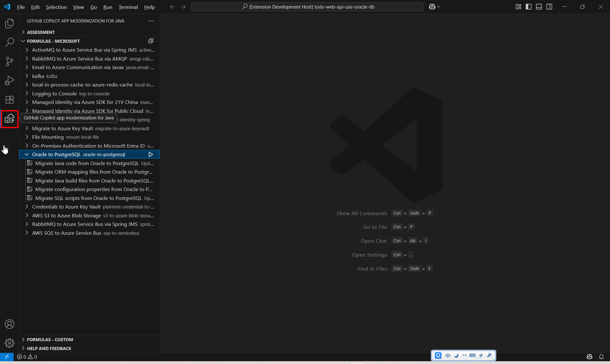
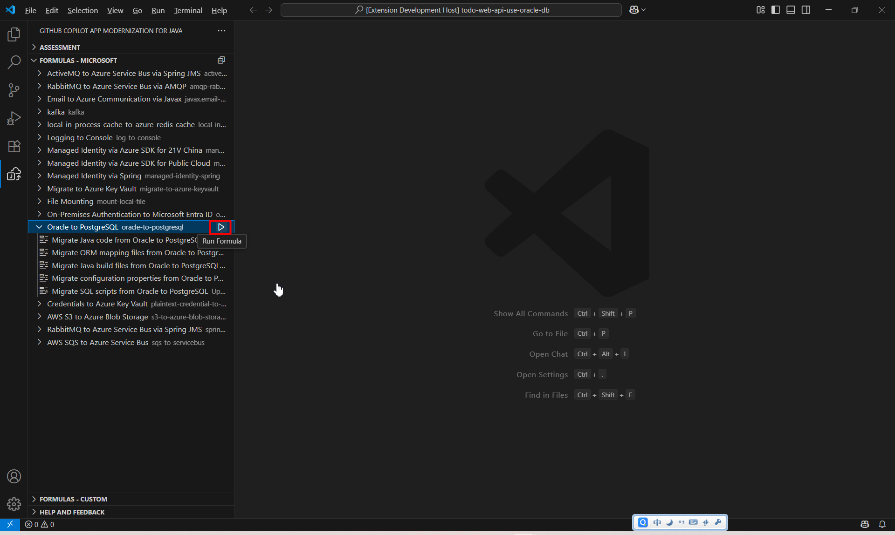
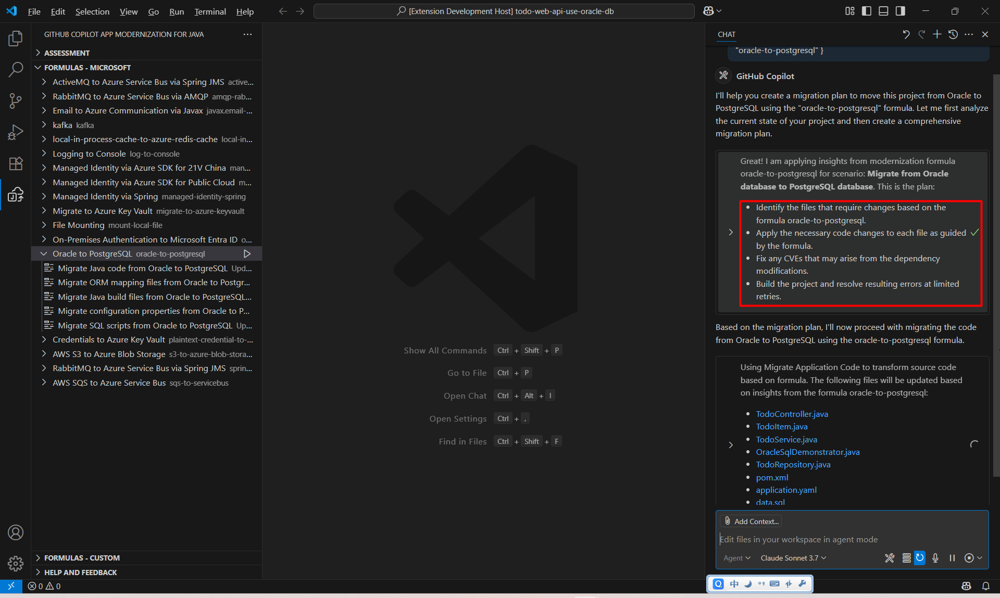
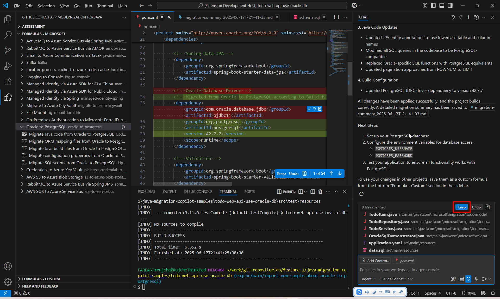

# Todo Web API with Oracle Database

This sample application demonstrates a Spring Boot REST API for managing Todo items using an Oracle database with JPA. The application showcases Oracle-specific SQL features and data types such as VARCHAR2.

## Features

- CRUD operations for Todo items
- Spring Data JPA with Oracle database
- Custom SQL queries using Oracle-specific features
- Oracle-specific data types and functions
- RESTful API endpoints

## Prerequisites

- Java 17 or higher
- Maven 3.8 or higher
- Docker (for running Oracle database container)
- Postman or any API testing tool (optional)

## Technology Stack

- Spring Boot 3.2.4
- Spring Data JPA
- Oracle Database 21c XE
- Project Lombok
- Maven

## Getting Started

### 1. Setting up Oracle Database with Docker

Run the following command to start an Oracle Database XE container:

```bash
docker run -d --name oracle-xe \
  -p 1521:1521 \
  -e ORACLE_PWD=oracle \
  container-registry.oracle.com/database/express:latest
```

Note: The first time you run this, it may take a few minutes for the database to initialize (typically 5-10 minutes). You can check if the database is ready by running:

```bash
docker logs oracle-xe | grep "DATABASE IS READY TO USE"
```

When you see the "DATABASE IS READY TO USE" message, the database is initialized and ready.

### 2. Clone the repository

```bash
git clone <repository-url>
cd todo-web-api-use-oracle-db
```

### 3. Build and run the application

Once the Oracle database is ready, you can build and run the application:

```bash
mvn clean spring-boot:run
```

The application will automatically:
1. Connect to the Oracle database using the SYSTEM account
2. Create the necessary tables using the schema.sql file (via Spring Boot's automatic schema initialization)
3. Insert sample data using the data.sql file (via Spring Boot's automatic data initialization)
4. Start the web server on port 8080

### 4. Access Sample Requests

### Get All Todos

```bash
curl -X GET http://localhost:8080/api/todos
```

### Create a Todo Item

```bash
curl -X POST http://localhost:8080/api/todos \
  -H "Content-Type: application/json" \
  -d '{
    "title": "Learn Oracle Database",
    "description": "Study Oracle-specific features and SQL syntax",
    "priority": 7,
    "dueDate": "2023-12-31T23:59:59"
  }'
```

## API Endpoints

| Method | URL                                | Description                                    |
|--------|----------------------------------- |------------------------------------------------|
| GET    | /api/todos                         | Get all todo items                             |
| GET    | /api/todos/{id}                    | Get a specific todo item by ID                 |
| POST   | /api/todos                         | Create a new todo item                         |
| PUT    | /api/todos/{id}                    | Update a todo item                             |
| DELETE | /api/todos/{id}                    | Delete a todo item                             |
| GET    | /api/todos/completed?completed=true| Get completed or incomplete todos              |
| GET    | /api/todos/high-priority?minPriority=5 | Get todos with priority >= minPriority    |
| GET    | /api/todos/search?keyword=project  | Search todos by keyword                        |
| GET    | /api/todos/top-priority            | Get top priority tasks                         |
| GET    | /api/todos/overdue                 | Get overdue tasks                              |
| PUT    | /api/todos/update-priority         | Update priority for tasks before cutoff date   |
| GET    | /api/todos/oracle-search?term=demo | Search using Oracle-specific functions         |
| GET    | /api/todos/oracle-demo             | Demonstrate Oracle-specific query features     |
| POST   | /api/todos/run-oracle-operations   | Run Oracle-specific database operations        |

## Oracle-Specific Features

This sample demonstrates several Oracle-specific features:

1. Oracle data types (VARCHAR2)
2. Oracle date functions (SYSDATE, SYSTIMESTAMP)
3. Oracle string functions (SUBSTR, INSTR)
4. Oracle-specific SQL syntax (ROWNUM)
5. PL/SQL blocks for complex operations

## Migrate form Oracle DB to PostgreSQL

## Migration Prerequisites

- [Visual Studio Code](https://code.visualstudio.com/download)
- [VS Code extension: GitHub Copilot app modernization for Java](https://marketplace.visualstudio.com/items?itemName=vscjava.migrate-java-to-azure)

## Migration Steps

1. Open current sample in Visual Studio Code.
1. Click `GitHub Copilot app modernization for Java`.
   > 
1. Find `Oracle to PostgreSQL`.
1. Click `Run formula`.
   > 
1. GitHub Copilot makes a plan for migrating this sample.
   > 
1. Click `Confirm` or `Continue` in the GitHub Copilot chat window if necessary, until the whole migration process finishes.
1. If everything goes well, it will finish migration work and give a summary file.
1. Click `keep` to save the changes.
   > 
